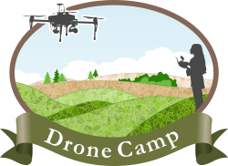

```{r setup, include=FALSE}
library(dplyr)
library(htmltools)
library(stringr)
```

```{r read_data, child='_read_data.Rmd', include=FALSE}
```

<div class="infobox">

<p style="text-align:center;">**Thanks to everyone for making DroneCamp 2020 a grand success!!**</p>

Thanks to all the participants, instructors, collaborators, and support people who came together to make this unique collaborative training program possible. Recordings for most sessions are now available - see the session descriptions for links. 

</div>

<div style="float:right; padding:5px; width:220px; text-align:center;"><br/><span style="letter-spacing: 0.1em; font-weight:800; font-size:110%; color:#836758; font-family:OCR A Std, Andale Mono, monospace;">ONLINE</span></div>

# DroneCamp 2020 Online


**Welcome to DroneCamp!**

DroneCamp is a short course on using drones for mapping and data collection. Now in its 4th year, the program is designed to cover a broad suite of knowledge and skills needed to use drones for mapping.

DroneCamp is a collaborative effort by several [campuses and research programs](#collaborators) within the University of California and California State University systems. Normally an in-person event at [CSU Monterey Bay](https://csumb.edu/){target="_blank" rel="noopener"}, DroneCamp 2020 is being held online due to the COVID-19 pandemic. For additional info, see [http://ucanr.edu/dronecamp](http://ucanr.edu/dronecamp){target="_blank" rel="noopener"}. 


## Schedule at a Glance

*All times are Pacific Daylight Time!*

```{r results="asis", echo=FALSE}
## Create the schedule at a glance

print(HTML("<table>"))

#dc_dates <- as.Date(paste0("2020-06-", c(18:19, 22:25)))
dc_dates <- as.Date(paste0("2020-06-", c(22:25)))

for (j in 1:length(dc_dates)) {
  dc_dt <- dc_dates[j]
  
  if (j > 1) {
    ## Print a blank row (spacer)
    print(HTML(paste0("<tr><td colspan=\"2\">&nbsp;</td></tr>")))
  }
  
  ## Print the date row
  print(HTML(paste0("<tr><td colspan=\"2\" class=\"glance-date\">", format(dc_dt, "%A %B %d"), "</td></tr>")))
  
  ws_today <- ws_all %>% filter(session_date == dc_dt) %>% arrange(track_dtsort, track_nameonly, wkshp_dtsort)
  track_name_last <- "none"
  
  for (i in 1:nrow(ws_today)) {
    
    track_name_this <- ws_today$track_nameonly[i]
    
    if (is.na(track_name_this) || track_name_this == "none") {
      
      if (track_name_last != "none") {
         ## A track just ended, put in a HR
         ## any visual cue needed?
        print(HTML(paste0("<tr class=\"glance-track-tr\"><td colspan=\"2\" class=\"glance-track-end\">&nbsp;</td></tr>")))
      } 
      
    } else {
      if (track_name_this != track_name_last) {
        #print(HTML(paste0("<tr><td colspan=\"2\" class=\"glance-track\">", track_name_this, "</td></tr>")))
        print(HTML(paste0("<tr><td class=\"glance-track-title\">&nbsp;</td><td class=\"glance-track-title\">", track_name_this, "</td></tr>")))
      }
      
    }
    
    ## Save this track name for the next loop
    track_name_last <- track_name_this
    
    ## Construct the time string
    time_only <- str_trim(str_split(ws_today$dt_readable[i], pattern = "\\|")[[1]][2])
    
    ## Prepare the blurb
    workshop_blurb <- ifelse(is.na(ws_today$blurb[i]), "",
                             paste("<br/><span class=\"glance-blurb\">", 
                                   ws_today$blurb[i], "</span>"))
    
    ## Prepare the href link
    href_link <- paste0("<a href=\"", format(dc_dt, "%Y-%m-%d"), ".html#",
                        ws_today$title[i] %>% 
                          gsub("[&,\\:\\(\\)\\/\\?]", "", .) %>% 
                          gsub("   ", " ", .) %>% 
                          gsub("  ", " ", .) %>% 
                          gsub(" ", "-", .) %>%
                          tolower(),
                        "\">")

    
#preview-of-the-monterey-bay-dart-uas-online-symposium-innovation-recovery
#preview-of-the-monterey-bay-dart-uas-online-symposium-innovation-&-recovery   
     
    print(HTML(paste0("<tr><td class=\"glance-time\">", time_only, 
                      "</td><td class=\"glance-title\">", 
                      href_link,
                      ws_today$title[i], 
                      "</a>",
                      workshop_blurb, "</td></tr>")))
    
  }
  
}

print(HTML("</table>"))
```

## Collaborators

*DroneCamp 2020 is brought to you by:*

<div style="text-align:center;">
<a href="https://ucanr.edu/" target="_blank" rel="noopener" style="text-decoration: none;">
<a href="http://igis.ucanr.edu/" target="_blank" rel="noopener" style="text-decoration:none;">
<a href="https://csumb.edu/" target="_blank" rel="noopener" style="text-decoration:none;">
<a href="https://www.ucop.edu/safety-and-loss-prevention/environmental/program-resources/unmanned-aircraft-systems-safety.html" target="_blank" rel="noopener" style="text-decoration:none;">
<a href="https://montereybaydart.org/" target="_blank" rel="noopener" style="text-decoration:none;"> 
<a href="https://ucnrs.org/" target="_blank" rel="noopener" style="text-decoration:none;">
<a href="https://fortordreserve.ucsc.edu/" target="_blank" rel="noopener" style="text-decoration:none;">
</div>
