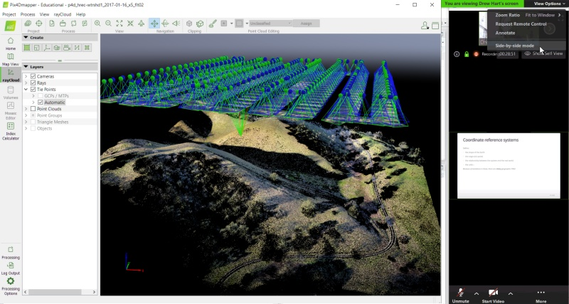

# Zoom Tips

## Setting Up Your Workspace 

Try to find a spot which is **comfortable** and **relatively free** from **distractions and background noise**. Some people find a pair of headphones helps minimize distractions. 

**Ergonomics** are important also! If you've ever tried to work on a laptop while sitting on a couch for 4 hours, it isn't ideal. If you plan on multitasking, considering joining the audio via phone and headset so you have the option to move around.                          

## Use the Zoom Client

Although you can join Zoom meetings through a browser, we recommend installing the [**Zoom Client for Meetings**](https://zoom.us/download){target="_blank" rel="noopener"}. You may already have it if you've used Zoom before, and you see it in the Start Menu (Windows) or Finder (Mac). Please **make sure you have the latest version**, as some of the buttons and features have changed.

**Note**: As of May 30 2020, Zoom will only allow you to connect to meetings with version 5.0 or higher of the Zoom client.

A **Zoom account** is *not* required. A **webcam** is *not* required. 

## Managing Zoom Audio

If you find your Zoom audio is garbled, perhaps due to poor bandwidth, you can **dial-in** with a phone. Click the microphone button on Zoom for details. In that case, you should disconnect from the the audio on your laptop or tablet (to prevent echo).

**Muting** and **unmuting** yourself are essential skills for Zoom. It's generally good practice to stay muted until you have something to say. If you're using the Zoom app on Windows, click the microphone button. If you're using the Zoom app for phones and tablets, tap the middle of the screen to make the controls visible. If you dial-in on a phone, you can use the 'mute' button on your phone app, or dial `*6` to mute or unmute yourself.

## Viewing Zoom and GIS Software Simultaneously

### Best Option: Dual Monitors

A **second screen** is very helpful, especially for hands-on workshops where you'll be working through a software exercise. With a second screen, you can view the instructor's slides or demo on one screen, and open your GIS program on the other. 

If you have an **external monitor** for your laptop / computer, you're all set. (Tip: turn on Zoom's *dual monitors* option, see below). Many TVs can be pulled into service as a second monitor depending on the video ports.

If you don't have a second monitor, a **tablet** may come in handy. You can only connect to Zoom on one device, but you can view the presentation & exercise instructions on the tablet as you work through the exercise on your laptop. Zoom is available as an app for all major tablets and phones.

{style="display:block; margin:1em auto; border:1px solid grey;"}

Connecting an external monitor to your computer is the best option for doing hands-on software workshops in Zoom

### Tips for Using Zoom on a Single Screen

#### Tip 1. Print out Exercises

Most of the software exercises have some kind of guide you can follow. 

#### Tip 2. Turn on 'Dual Monitors'

The Zoom client for Windows has a 'Dual Monitors' option that will open up screen shares in a **separate window**. You don't actually need two monitors. This option is really useful on a single monitor, because you can move and resize the screen share window anywhere you'd like (and even 'pin' it to stay on top, see below).

To turn on Dual Monitors, click the gear icon (Settings) in the Zoom client, then check 'Dual Monitors'.

{style="display:block; margin:1em auto; border:1px solid grey;"}

{style="display:block; margin:1em auto; border:1px solid grey;"}

#### Tip 3. Place Windows Side-by-Side

You can arrange your windows so that you see both your GIS program and Zoom side-by-side (see below for example). You can devote the entire width of the Zoom window to the screen share by going to 'View Options' and making sure side-by-side mode is turned **off**.

A keyboard shortcut to move windows to the left or right is *windows key* + *left/right arrows*. You can then choose which of the remaining windows to put in the other half of the screen. By default, Windows will divide the screen into equal halves, but if you resize the width right after you use the shortcut, it will remember the setting. 

{style="display:block; margin:1em auto; border:1px solid grey;"}

Arranging GIS and Zoom side-by-side on a single screen

#### Tip 4. Use Sticky Notes

If you like to take notes during Zoom meetings, a Sticky Notes utility can help. Almost all sticky notes programs have an option to stay on top, so you don't have to worry about your notes disappearing. Windows has a built-in 'Sticky Notes' app, but an even better one is [Stickies](https://www.zhornsoftware.co.uk/){target="_blank" rel="noopener"} from Zhorn Software.

#### Tip 5. Keep Windows on Top with DeskPins

Surprisingly Zoom does not have an 'always on top' mode, but you can keep the Zoom client on top by using a 3rd party utility like [DeskPins](https://efotinis.neocities.org/deskpins/index.html){target="_blank" rel="noopener"} (Windows). 

In conjunction with Zoom's Dual Monitor options, DeskPins lets you 'pin' the screen share window on top, so you can watch the presenter's demo while also working in your GIS program. Pinned windows can still be resized and moved around so it doesn't get in the way of what you're working on. 

{style="display:block; margin:1em auto; border:1px solid grey;"}

To 'pin' a window, right-click on the DeskPins icon in the system tray, and select 'Enter Pin Mode'. To 'unpin' a window, simply click the little 'x' button that appears when you hover over the pushpin icon.

\

